# Architecture Diagrams - Polyglot Microservices BookStore

Tài liệu này chứa các biểu đồ kiến trúc được vẽ bằng Mermaid.js.

---

## 1. System Architecture Overview

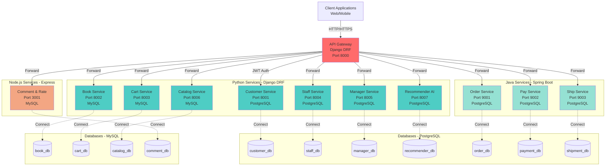

---

## 2. Authentication Flow

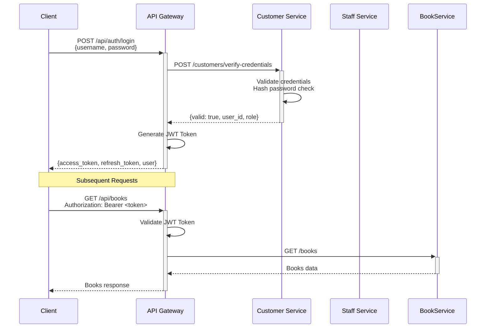

---

## 2.1. Add Book Flow (Via API Gateway)

```mermaid
sequenceDiagram
    participant Client
    participant Gateway as API Gateway
    participant BookService as Book Service
    participant BookDB as book_db (MySQL)

    Client->>+Gateway: POST /api/books/create<br/>Authorization: Bearer <staff_or_manager_token><br/>{isbn, title, author, price, stock_quantity}
    Gateway->>Gateway: Validate JWT token
    Gateway->>+BookService: POST /books/create/<br/>{book payload}

    BookService->>BookService: Validate input<br/>(required fields, ISBN, price, stock)

    alt Valid request
        BookService->>+BookDB: INSERT INTO books (...)
        BookDB-->>-BookService: New book_id
        BookService-->>-Gateway: 201 Created<br/>{id, isbn, title, ...}
        Gateway-->>-Client: 201 Created<br/>{id, isbn, title, ...}
    else Invalid payload / business rule failed
        BookService-->>-Gateway: 400 Bad Request<br/>{error, details}
        Gateway-->>-Client: 400 Bad Request<br/>{error, details}
    end
```

---

## 3. Order Processing Flow

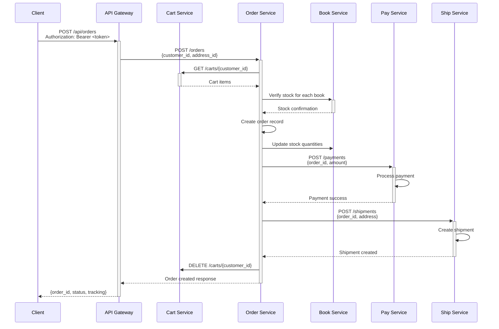

---

## 4. Order Processing Flow - Two-Phase Commit (2PC)

### 4.1. Happy Path - Success Scenario

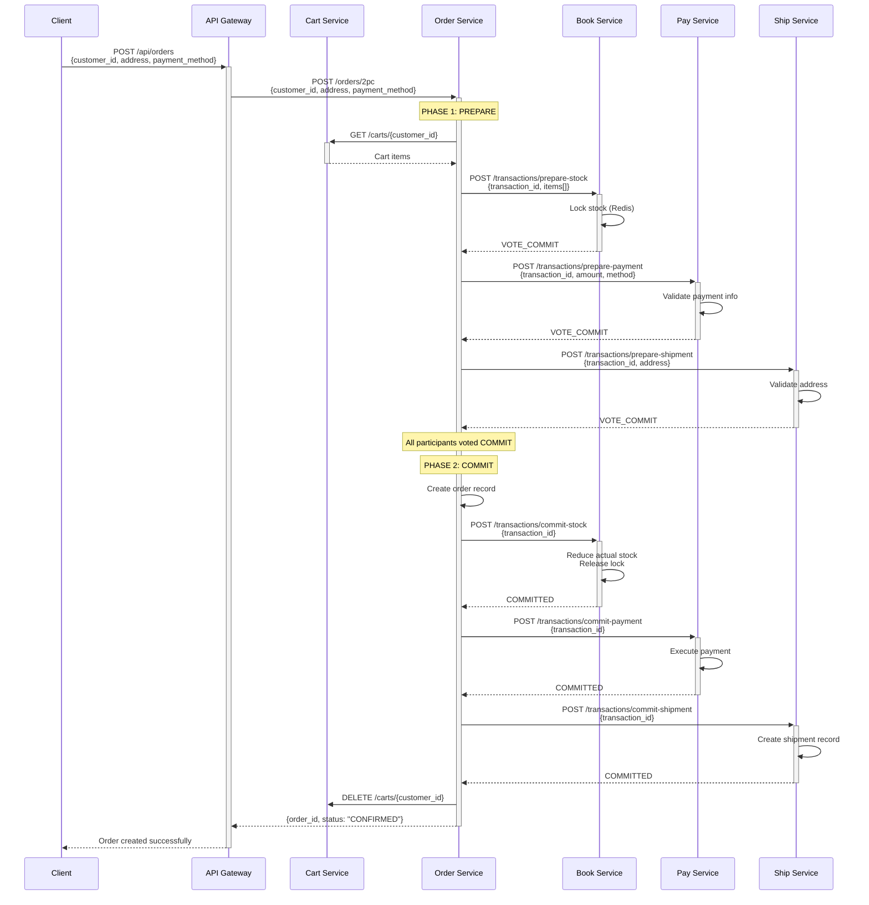

### 4.2. Rollback Scenario - Prepare Phase Failure

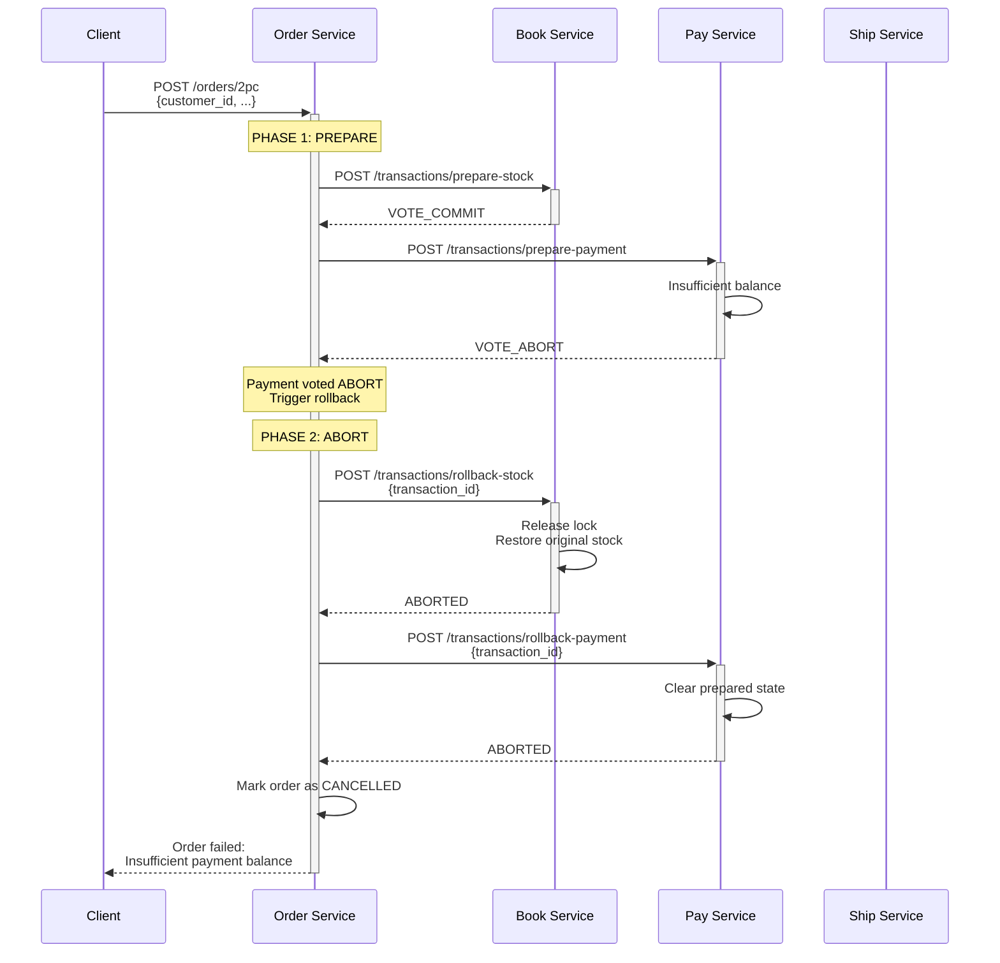

---

## 5. Order Processing Flow - Saga Pattern (Orchestration)

### 5.1. Happy Path - All Steps Succeed

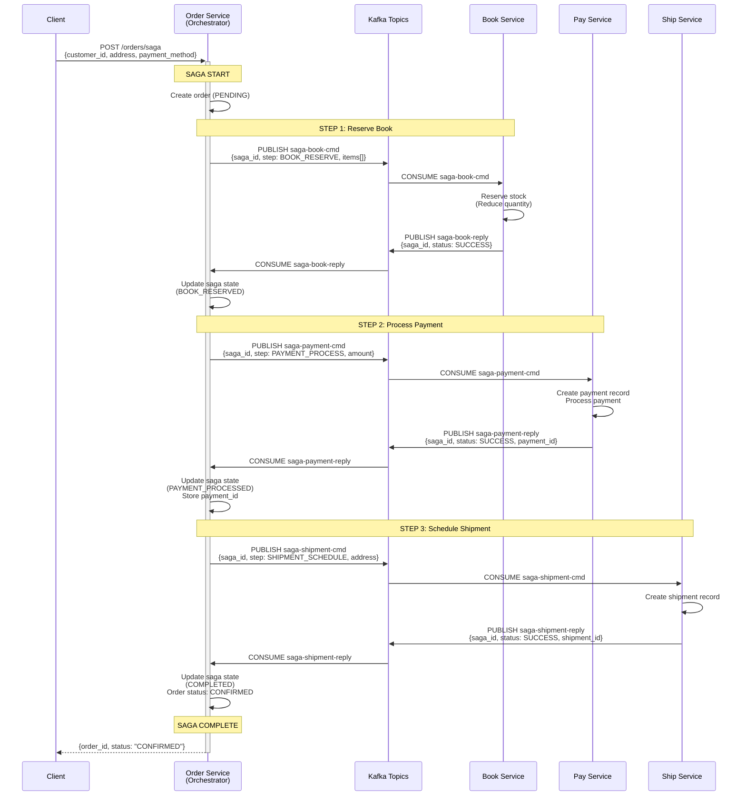

### 5.2. Compensation Flow - Shipment Service Down

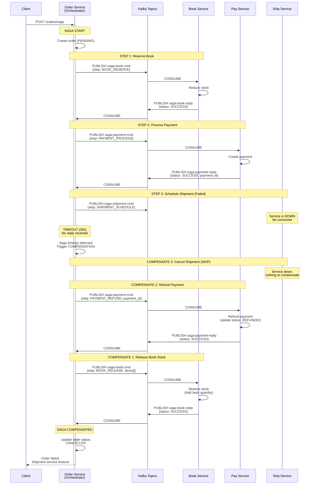

### 5.3. Compensation Flow - Payment Failure

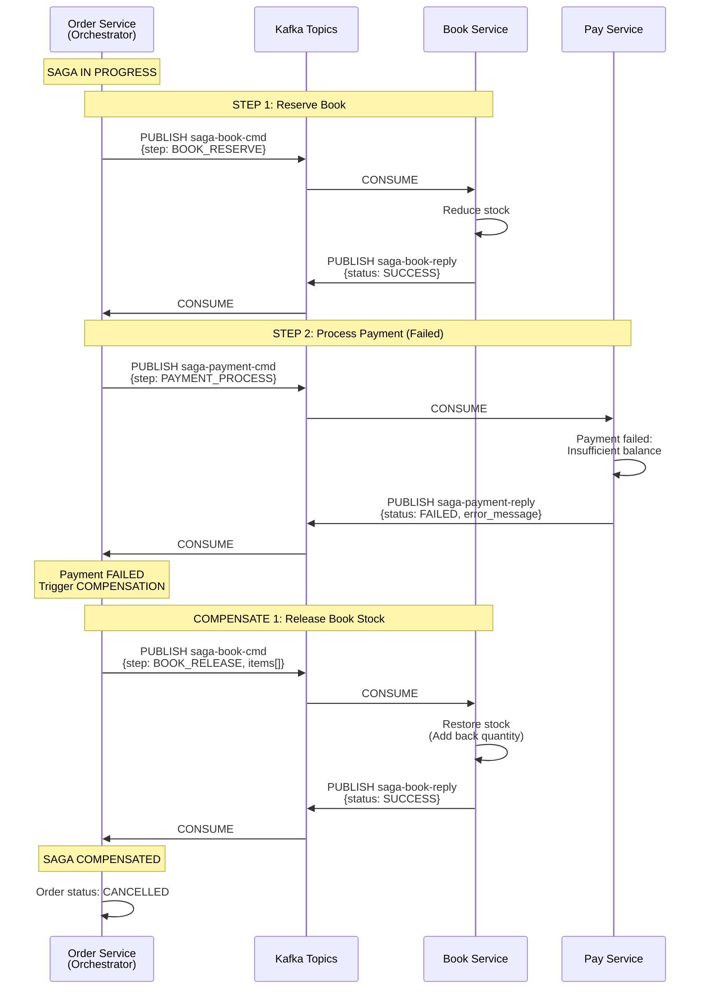

---

## 6. Service Dependencies Graph

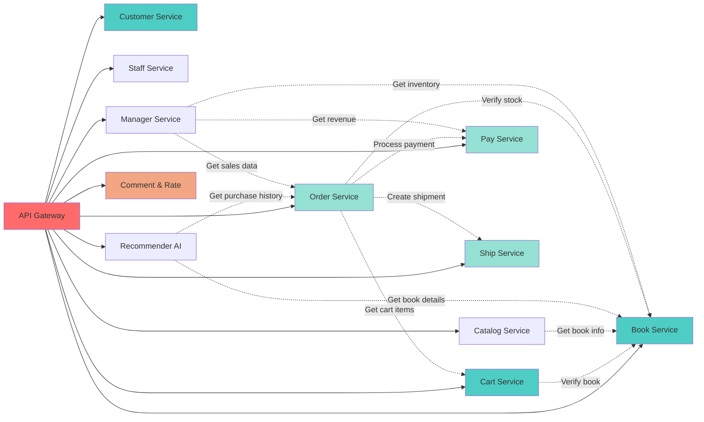

---

## 7. Database Schema Diagram

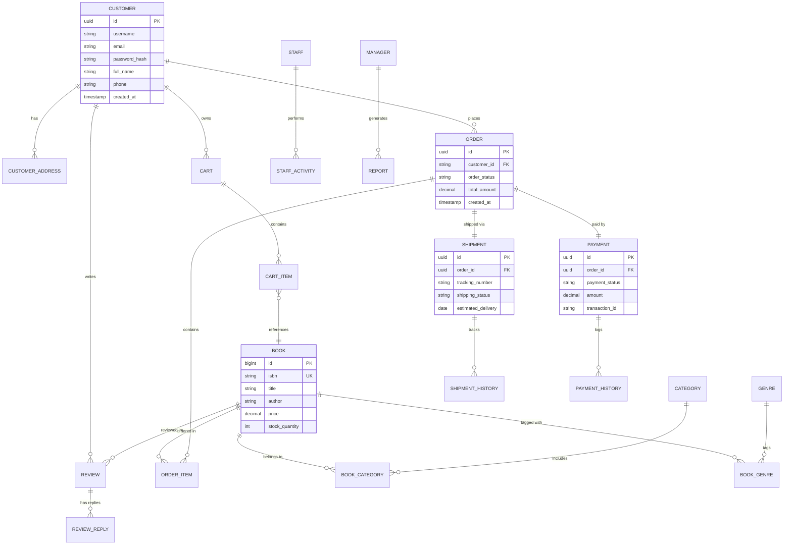

---

## 8. Deployment Architecture (Docker Compose)

```mermaid
graph TB
    subgraph "Docker Network: bookstore-network"
        subgraph "Service Layer"
            GW[api-gateway:8000]
            C1[customer-service:8001]
            C2[book-service:8002]
            C3[cart-service:8003]
            C4[staff-service:8004]
            C5[manager-service:8005]
            C6[catalog-service:8006]
            C7[recommender-ai-service:8007]
            J1[order-service:9001]
            J2[pay-service:9002]
            J3[ship-service:9003]
            N1[comment-rate-service:3001]
        end
        
        subgraph "PostgreSQL Containers"
            PG1[(postgres-customer:5432)]
            PG2[(postgres-staff:5433)]
            PG3[(postgres-manager:5434)]
            PG4[(postgres-recommender:5435)]
            PG5[(postgres-order:5436)]
            PG6[(postgres-payment:5437)]
            PG7[(postgres-shipment:5438)]
        end
        
        subgraph "MySQL Containers"
            MY1[(mysql-book:3306)]
            MY2[(mysql-cart:3307)]
            MY3[(mysql-catalog:3308)]
            MY4[(mysql-comment:3309)]
        end
        
        C1 -.->|DB Connection| PG1
        C4 -.->|DB Connection| PG2
        C5 -.->|DB Connection| PG3
        C7 -.->|DB Connection| PG4
        J1 -.->|DB Connection| PG5
        J2 -.->|DB Connection| PG6
        J3 -.->|DB Connection| PG7
        
        C2 -.->|DB Connection| MY1
        C3 -.->|DB Connection| MY2
        C6 -.->|DB Connection| MY3
        N1 -.->|DB Connection| MY4
    end
    
    Client[External Client]
    Client -->|Port 8000| GW
    
    style GW fill:#ff6b6b
    style C1 fill:#4ecdc4
    style C2 fill:#4ecdc4
    style C3 fill:#4ecdc4
    style C4 fill:#4ecdc4
    style C5 fill:#4ecdc4
    style C6 fill:#4ecdc4
    style C7 fill:#4ecdc4
    style J1 fill:#95e1d3
    style J2 fill:#95e1d3
    style J3 fill:#95e1d3
    style N1 fill:#f3a683
```

---

## 9. Health Check & Monitoring Flow

```mermaid
graph TB
    Monitor[Monitoring System]
    
    subgraph "Health Endpoints"
        H1[/health - Gateway]
        H2[/health - Customer]
        H3[/health - Book]
        H4[/health - Cart]
        H5[/health - Staff]
        H6[/health - Manager]
        H7[/health - Catalog]
        H8[/health - Recommender]
        H9[/health - Order]
        H10[/health - Pay]
        H11[/health - Ship]
        H12[/health - Comment]
    end
    
    subgraph "Metrics Endpoints"
        M1[/metrics - Gateway]
        M2[/metrics - Customer]
        M3[/metrics - Book]
        M4[/metrics - Cart]
        M5[/metrics - Staff]
        M6[/metrics - Manager]
        M7[/metrics - Catalog]
        M8[/metrics - Recommender]
        M9[/metrics - Order]
        M10[/metrics - Pay]
        M11[/metrics - Ship]
        M12[/metrics - Comment]
    end
    
    Monitor -->|Poll every 30s| H1
    Monitor -->|Poll every 30s| H2
    Monitor -->|Poll every 30s| H3
    Monitor -->|Poll every 30s| H4
    Monitor -->|Poll every 30s| H5
    Monitor -->|Poll every 30s| H6
    Monitor -->|Poll every 30s| H7
    Monitor -->|Poll every 30s| H8
    Monitor -->|Poll every 30s| H9
    Monitor -->|Poll every 30s| H10
    Monitor -->|Poll every 30s| H11
    Monitor -->|Poll every 30s| H12
    
    Monitor -->|Collect| M1
    Monitor -->|Collect| M2
    Monitor -->|Collect| M3
    Monitor -->|Collect| M4
    Monitor -->|Collect| M5
    Monitor -->|Collect| M6
    Monitor -->|Collect| M7
    Monitor -->|Collect| M8
    Monitor -->|Collect| M9
    Monitor -->|Collect| M10
    Monitor -->|Collect| M11
    Monitor -->|Collect| M12
    
    style Monitor fill:#ffd93d
```

---

## 10. User Journey - Customer Purchasing Book

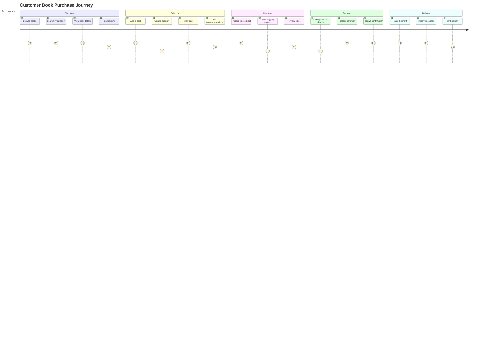

---

## 11. Component Communication Pattern

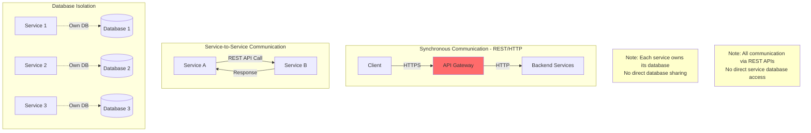

---

## 12. Scalability Architecture

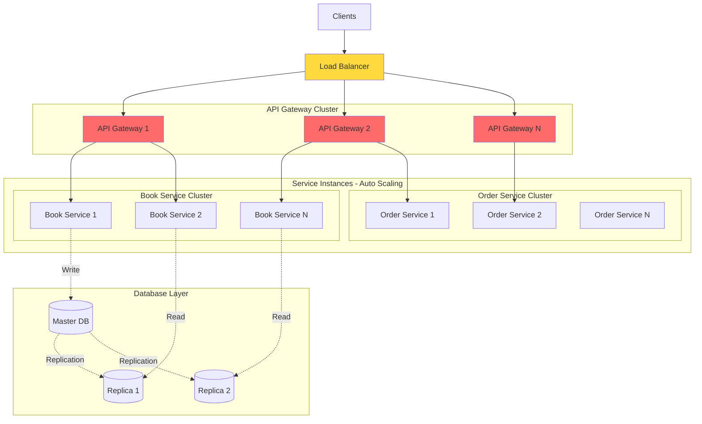

---

## 13. Technology Stack Visualization

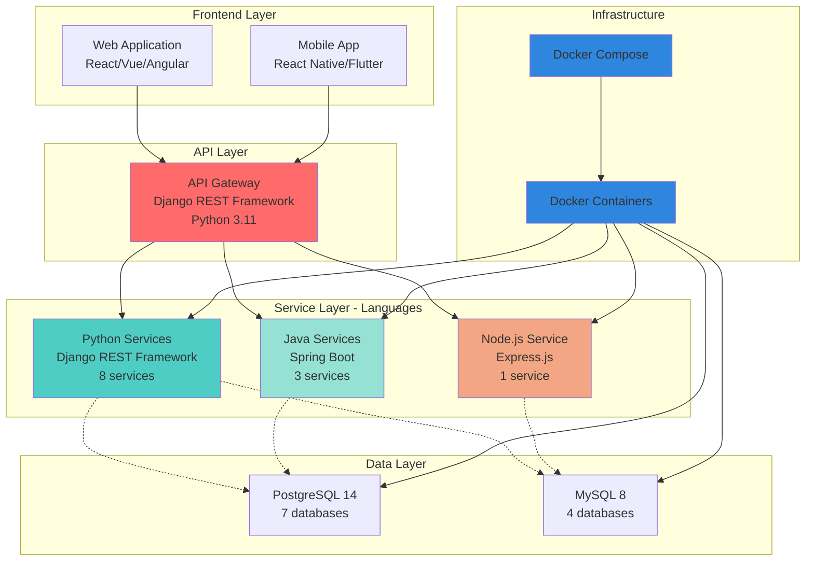

---

## 14. Error Handling & Circuit Breaker Pattern

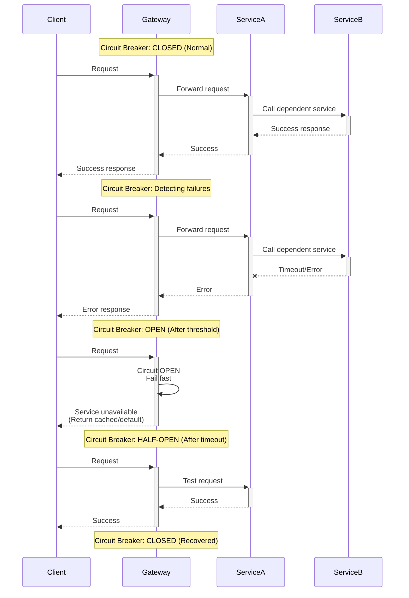

---

**Version**: 1.0  
**Last Updated**: March 4, 2026  
**Status**: Architecture Diagrams Complete
